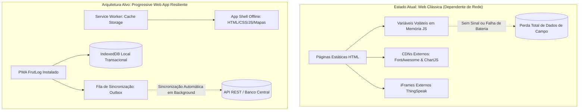
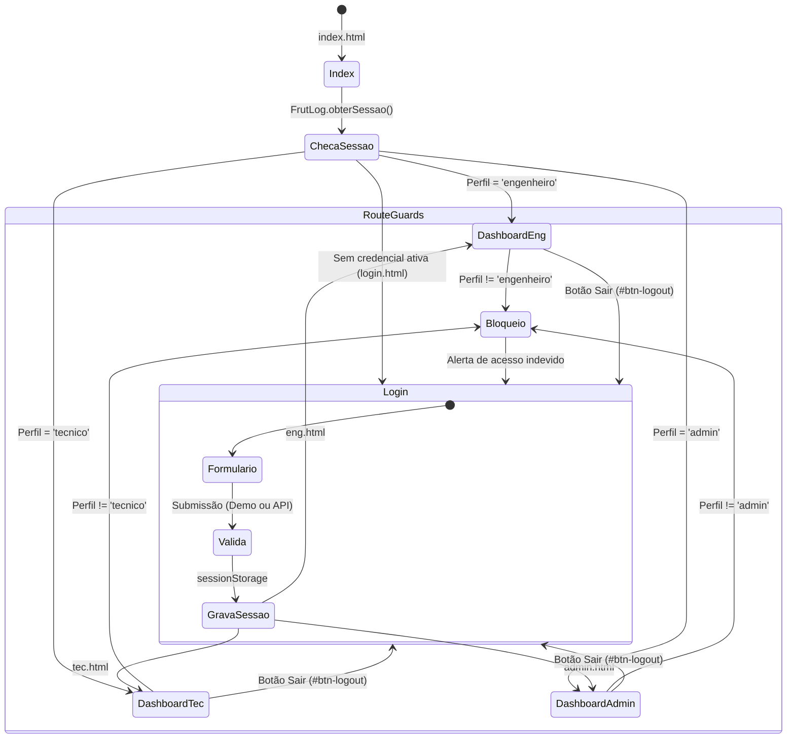
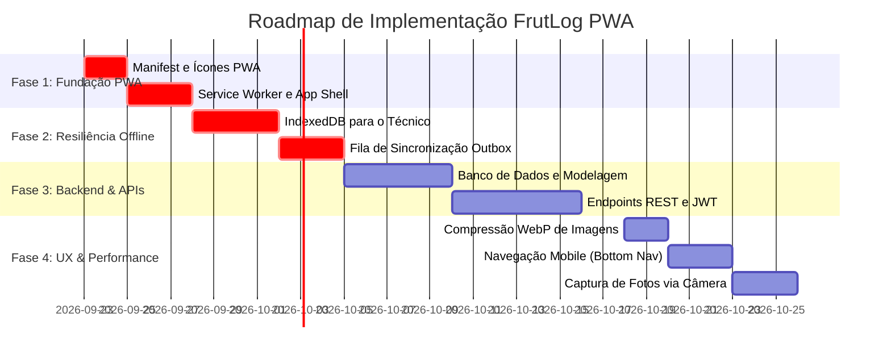

# DIAGNÓSTICO ARQUITETURAL E ESPECIFICAÇÃO TÉCNICA PWA — FRUTLOG

> **Documento Oficial de Engenharia de Software**  
> **Sistema:** FrutLog — Gestão e Monitoramento Inteligente de Cultivo  
> **Data de Emissão:** 22 de Setembro de 2026  
> **Responsável Técnico:** Arquiteto de Software e Engenheiro Frontend Sênior (PWA)  
> **Versão do Documento:** 1.0.0  

---

## 1. Visão Geral da Arquitetura PWA

### 1.1. Estado Atual vs. Arquitetura Alvo PWA

O FrutLog opera atualmente como uma **Multi-Page Application (MPA)** estática com Vanilla JavaScript, CSS3 estruturado e dependência contínua de conexão à internet. O sistema ainda **não possui capacidades de Progressive Web App (PWA) ativas**, o que impede a instalação nos dispositivos e impossibilita o uso em áreas de campo sem cobertura de rede celular.



| Componente Arquitetural | Estado Atual no Código | Especificação Alvo (PWA) |
| :--- | :--- | :--- |
| **Web App Manifest** | Inexistente. | `manifest.json` com `display: standalone`, `theme_color: #2e7d32`, matriz de ícones adaptativos (192px, 512px, maskable) e shortcuts para ações rápidas. |
| **Service Worker** | Inexistente. | `service-worker.js` gerenciando interceptação de requisições, ciclo de vida (*install*, *activate*, *fetch*) e integridade do cache. |
| **Estratégia de Cache** | Nenhuma (todas as requisições vão à rede). | Cache-First para o App Shell e fontes/ícones; Network-First com fallback para APIs; Store-and-Forward para coletas de campo. |
| **Operação Offline** | Inoperante (exibe tela de erro do navegador). | App Shell 100% funcional sem sinal de operadora. |
| **Persistência de Dados** | `sessionStorage` e arrays na memória RAM. | IndexedDB transacional no cliente com sincronização em segundo plano (*Background Sync API*). |

### 1.2. Estratégias de Cache por Tipo de Recurso

1. **App Shell (Estrutura Básica):**
   - **Recursos:** `index.html`, `login.html`, `eng.html`, `tec.html`, `admin.html`, arquivos CSS locais, scripts JS e imagem base do mapa.
   - **Estratégia:** *Cache-First* (com invalidação por versão no Service Worker).
   - **Objetivo:** Inicialização instantânea (< 1s) mesmo em modo avião.
2. **Dependências Externas (Font Awesome, Chart.js):**
   - **Estratégia:** *Cache-First* com fallback permanente após a instalação.
   - **Objetivo:** Evitar que ícones sumam ou que gráficos quebrem quando a equipe estiver no campo.
3. **Telemetria e Sensores Ambientais:**
   - **Estratégia:** *Network-First com fallback para o último dado conhecido*.
   - **Objetivo:** Exibir sempre o dado mais recente da estação IoT; quando sem rede, exibir o último valor em cache com etiqueta visual informativa.
4. **Coleta de Campo (Inspeções, Ocorrências e Defeitos):**
   - **Estratégia:** *Store-and-Forward (Outbox Pattern)*.
   - **Objetivo:** Gravar primeiro no IndexedDB com flag `sincronizado: false` e despachar para a API em segundo plano assim que a conectividade for restabelecida.

### 1.3. Stack Tecnológica e Padrões Adotados

- **Linguagens e Core:** HTML5 semântico, CSS3 com variáveis de design tokens (`:root`), JavaScript Vanilla moderno (ES6+ modular via IIFE).
- **APIs Nativas PWA do Navegador:** Service Workers API, Cache Storage API, Web App Manifest Specification, IndexedDB API, Web Storage (`sessionStorage` e `localStorage`), Pointer Events API.
- **Bibliotecas Externas:**
  - [Chart.js](https://cdn.jsdelivr.net/npm/chart.js): Gráficos analíticos e gerenciais em Canvas.
  - [Font Awesome](https://cdnjs.cloudflare.com/ajax/libs/font-awesome/6.5.1/css/all.min.css): Iconografia vetorial.
  - [ThingSpeak IoT](https://thingspeak.com): iFrames de telemetria ambiental em tempo real.
- **Qualidade e Testes:** Playwright (`frutlog-smoke.spec.js`) para testes de fumaça, integridade de navegação e consoles limpos.

---

## 2. Mapeamento de Ecrãs e Fluxos de Navegação

### 2.1. Catálogo Completo dos Ecrãs

O sistema divide-se em 5 ecrãs fundamentais:

| # | Ecrã / Ficheiro | Perfil de Utilizador | Propósito e Escopo Funcional |
| :-: | :--- | :--- | :--- |
| **01** | [`index.html`](file:///c:/Users/PC/Desktop/Projeto%20Itegrador%202026-13-9/index.html) | Público / Todos | **Splash & Roteador Inicial:** Inspeciona a sessão no navegador via `js/index.js`. Se houver sessão ativa, redireciona de imediato para o painel correspondente ao perfil; caso contrário, disponibiliza botão para o login. |
| **02** | [`login.html`](file:///c:/Users/PC/Desktop/Projeto%20Itegrador%202026-13-9/login.html) | Público / Todos | **Central de Autenticação:** Controlada por `js/login.js`. Validação de credenciais, alternador de visualização de senha, modo demonstração com seletor de perfil e comunicação assíncrona com endpoint de login. |
| **03** | [`eng.html`](file:///c:/Users/PC/Desktop/Projeto%20Itegrador%202026-13-9/eng.html) | `engenheiro` | **Painel do Engenheiro Agrônomo:** Planejamento agrícola, telemetria analítica, editor interativo de talhões em SVG/GeoJSON (criar, fatiar, mover vértices e excluir), acompanhamento ThingSpeak, gráficos de safras e cadastro de culturas. |
| **04** | [`tec.html`](file:///c:/Users/PC/Desktop/Projeto%20Itegrador%202026-13-9/tec.html) | `tecnico` | **Painel do Técnico Agrícola (Campo):** Interface mobile-first para execução de tarefas diárias prioritárias, visualização rápida de talhões no mapa, registro de inspeções, apontamento de ocorrências fitossanitárias, monitoramento de sensores e alertas urgentes. |
| **05** | [`admin.html`](file:///c:/Users/PC/Desktop/Projeto%20Itegrador%202026-13-9/admin.html) | `admin` | **Painel Administrativo:** Governança corporativa, cadastro de funcionários com geração de matrícula automática sequencial, auditoria de usuários ativos (online/offline em tempo real), mapa geral da propriedade e gráficos anuais. |

### 2.2. Fluxo de Navegação e Guardas de Rota (Route Guards)

A navegação entre páginas é controlada centralmente pelo objeto `FrutLog` em [`js/global.js`](file:///c:/Users/PC/Desktop/Projeto%20Itegrador%202026-13-9/js/global.js):



1. **Proteção de Acesso (`FrutLog.verificarSessao(perfisPermitidos)`):**
   - Executada no carregamento do DOM de cada painel.
   - Caso o perfil do usuário logado não conste na lista de perfis autorizados da página, o sistema emite alerta visual e o redireciona automaticamente para o dashboard do seu perfil via `window.location.replace()`.
2. **Navegação Interna (Intra-Ecrã):**
   - Dentro de cada dashboard, a barra lateral (`<aside class="sidebar">`) utiliza âncoras de fragmento (`#id`) associadas a `html { scroll-behavior: smooth; }`, permitindo alternar rapidamente entre seções sem recarregar a página.
3. **Comunicação de Estado Entre Páginas:**
   - **`sessionStorage`:** Compartilha credenciais, perfil e token JWT.
   - **`localStorage` (`frutlog_talhoes_geojson`):** Compartilha a malha geográfica dos talhões em tempo real entre o Engenheiro e o Técnico.

---

## 3. Matriz de Permissões e Regras de Negócio por Perfil

### 3.1. Matriz RBAC (Role-Based Access Control)

| Recurso / Entidade | Engenheiro Agrônomo | Técnico Agrícola | Administrador |
| :--- | :---: | :---: | :---: |
| **Geometrias de Talhões (SVG/GeoJSON)** | **CRUD Total** (Criar, Dividir, Editar, Deletar) | **Leitura** (Visualização no terreno) | **Leitura** (Supervisão macro) |
| **Cadastro de Cultivo & Safra** | **Criar e Editar** (Cultura, limites, variedades) | **Leitura** (Consulta de parâmetros) | ⛔ Sem Acesso |
| **Telemetria Analítica & IoT** | **Leitura Avançada** (Tabelas e ThingSpeak) | **Leitura Operacional** (Último valor) | ⛔ Sem Acesso |
| **Tarefas do Dia & Alertas** | ⛔ Sem Acesso | **Executar e Consultar** | ⛔ Sem Acesso |
| **Registro de Inspeções de Campo** | **Leitura** (Diagnóstico e recomendações) | **Criar Registros** | ⛔ Sem Acesso |
| **Apontamento de Ocorrências / Pragas** | ⛔ Sem Acesso | **Criar Registros** | ⛔ Sem Acesso |
| **Reporte de Falhas em Sensores** | ⛔ Sem Acesso | **Criar e Consultar** | ⛔ Sem Acesso |
| **Cadastro de Colaboradores (RH)** | ⛔ Sem Acesso | ⛔ Sem Acesso | **CRUD Total** (Matrículas e perfis) |
| **Auditoria de Sessões Ativas** | ⛔ Sem Acesso | ⛔ Sem Acesso | **Monitoramento em Tempo Real** |
| **Indicadores Gerais de Safra e Clima** | **Leitura Técnica** (Sacas/Toneladas) | ⛔ Sem Acesso | **Leitura Executiva** (Chart.js) |

### 3.2. Regras de Negócio Específicas por Perfil

#### A. Engenheiro Agrônomo
* **Topologia Espacial Fechada:** Todo polígono desenhado precisa ter o anel fechado (`coordenadas[0] === coordenadas[N]`). A criação exige duplo clique e a divisão exige exatamente dois pontos para calcular a reta secante de corte.
* **Salvaguarda de Talhões:** O sistema proíbe a exclusão do talhão caso reste apenas 1 na propriedade (`talhoes.length <= 1`).
* **Inferência de Alerta Térmico (`calcularStatusMonitoramento()`):**
  - **Crítico:** Se $\text{Temp Atual} > \text{Temp Máxima}$.
  - **Atenção:** Se $\text{Temp Atual} \ge (\text{Temp Máxima} - 1^\circ\text{C})$ ou se o sensor estiver ausente.
  - **Normal:** Se $\text{Temp Atual} < (\text{Temp Máxima} - 1^\circ\text{C})$.
* **Conversão Dinâmica de Safras:** Gráficos e cards alternam instantaneamente entre Toneladas e Sacas aplicando o fator agronômico de **$16{,}67\text{ sacas/tonelada}$** ($1.000\text{ kg} \div 60\text{ kg}$).

#### B. Técnico Agrícola
* **Geração Autônoma de Tarefas:** A lista de tarefas prioritárias é gerada pelo sistema a cada inicialização, filtrando automaticamente talhões em estado *Crítico*, *Atenção* ou *Sem Sensor*.
* **Taxonomia Fechada de Ocorrências:** As anomalias de campo são restritas às categorias: *Pragas, Doenças, Falta de água, Excesso de água, Desenvolvimento irregular, Problema no sensor ou Outro*.
* **Precedência Cronológica:** Todo registro novo de campo entra com prioridade no topo (`unshift`) das tabelas.
* **Isolamento de Falha:** Problemas fisiológicos de plantas vão para *Inspeção/Ocorrência*; falhas físicas de equipamento vão para *Problema no Sensor*.

#### C. Administrador
* **Imutabilidade e Sequenciamento de Matrícula:** O campo de matrícula é `readonly` e incrementa $+1$ automaticamente a partir de `4001` a cada cadastro bem-sucedido.
* **Controle de Presença:** Sessões ativas exibem selos luminosos pulsantes: verde para colaboradores *Online* e vermelho para *Offline*.

---

## 4. Funcionalidades Implementadas vs. Pendentes (Backlog)

### 4.1. Tabela Comparativa de Recursos

| Funcionalidade / Módulo | Implementado no Frontend | Simulado (Mock) | Pendente para Produção |
| :--- | :---: | :---: | :---: |
| Editor SVG de Talhões (Criar, Dividir, Mover, Deletar) | ✅ 100% Funcional | — | — |
| Cálculo de Limites Térmicos e Severidade | ✅ 100% Funcional | — | — |
| Gráficos Chart.js (Colheita, Clima, Ton/Sacas) | ✅ 100% Funcional | — | — |
| Algoritmo Dinâmico de Tarefas do Dia | ✅ 100% Funcional | — | — |
| Validação de Formulários e Feedbacks Acessíveis | ✅ 100% Funcional | — | — |
| Route Guards e Controle de Acesso por Perfil | ✅ 100% Funcional | — | — |
| Smoke Tests Automatizados Playwright | ✅ 100% Funcional | — | — |
| **Persistência de Inspeções do Técnico** | ❌ | ⚠️ Em memória RAM | ⏳ Banco IndexedDB (`js/db.js`) |
| **Fila de Sincronização de Campo (Outbox Queue)**| ❌ | ❌ | ⏳ Sincronização em background |
| **Web App Manifest (`manifest.json`)** | ❌ | ❌ | ⏳ Criar manifesto e ícones |
| **Service Worker & Cache Offline (App Shell)** | ❌ | ❌ | ⏳ Criar `service-worker.js` |
| **Autenticação Real via API REST** | ⚠️ Preparado | ⚠️ Modo Demo ativo | ⏳ Validar token JWT no backend |
| **Endpoints REST de Persistência em Banco** | ⚠️ Preparado | ⚠️ Simulado no console| ⏳ Conectar banco relacional |

### 4.2. Backlog Priorizado de Engenharia



---

## 5. Auditoria de Erros e Oportunidades de Melhoria

### 5.1. Não-Conformidades Identificadas

1. **Tabela de Funcionários Cadastrados Eternamente Vazia (`admin.html`):**  
   A tabela `<tbody id="tabela-funcionarios">` existe no HTML, mas `js/admin.js` não possui função de carregamento nem rotina de renderização pós-cadastro.
2. **Mapa Desatualizado no Administrador:**  
   Em `admin.html`, os polígonos dos talhões estão estáticos e hardcoded no HTML, sem importar `js/frutlog-talhoes.js`. Alterações feitas pelo Engenheiro não aparecem para o Administrador.
3. **Seção Órfã na Sidebar do Técnico (`tec.html`):**  
   A seção `<section id="problema-sensor">` existe na página, mas o menu lateral não possui hiperlink correspondente, obrigando o técnico a rolar a tela manualmente.
4. **Reset da Matrícula do Administrador:**  
   A variável `proximaMatriculaFuncionario = 4001` reside na memória RAM, reiniciando a cada F5 e possibilitando matrículas duplicadas.
5. **Gargalo Crítico de Imagem (`fotinha.png`):**  
   Arquivo com **1.58 MB** carregado no fundo das telas de login e index, destruindo os índices LCP/FCP em redes móveis rurais.
6. **Erro Sintático em Token CSS (`css/eng.css` - Linha 112):**  
   Uso de `box-shadow: var(--sombra-car);` em vez de `var(--sombra-card)`. O navegador descarta a propriedade.
7. **Espaço em Branco em Atributo URL (`eng.html` - Linha 157):**  
   Presença de espaço em `src=" https://thingspeak..."`, violando boas práticas e dificultando matching de URL em Service Workers.
8. **Divergência de Portas nos Testes:**  
   `.vscode/settings.json` define a porta do Live Server como `5501`, enquanto `frutlog-smoke.spec.js` testa contra `5500`.

---

### 5.2. Códigos e Soluções de Correção Prática

#### Correção 1: Correção do Token CSS (`css/eng.css`)
```css
/* Linha 112 em css/eng.css: */
.graficos-thingspeak-item {
  min-width: 0;
  padding: 18px;
  background-color: var(--cor-card);
  border-radius: 10px;
  box-shadow: var(--sombra-card); /* Corrigido */
  display: flex;
  flex-direction: column;
  justify-content: center;
  box-sizing: border-box;
  overflow: hidden;
  align-items: center;
}
```

#### Correção 2: Remoção do Espaço no iFrame (`eng.html`)
```html
<!-- Linha 157 em eng.html: -->
<iframe src="https://thingspeak.com/channels/3494574/charts/1?dynamic=true&results=60&type=line" title="Gráfico de temperatura do ThingSpeak"></iframe>
```

#### Correção 3: Adição do Link Órfão no Menu do Técnico (`tec.html`)
```html
<!-- Dentro de <nav class="menu"> em tec.html: -->
<a href="#sensores" class="nav-link"><i class="fa-solid fa-microchip" aria-hidden="true"></i> Sensores</a>
<a href="#problema-sensor" class="nav-link"><i class="fa-solid fa-screwdriver-wrench" aria-hidden="true"></i> Falha no Sensor</a>
<a href="#alertas" class="nav-link"><i class="fa-solid fa-bell" aria-hidden="true"></i> Alertas</a>
```

#### Correção 4: Sincronização da Porta do Live Server (`.vscode/settings.json`)
```json
{
  "liveServer.settings.port": 5500
}
```

#### Correção 5: Tabela Dinâmica e Matrícula no Administrador (`js/admin.js`)
```javascript
const CHAVE_MATRICULA = "frutlog_proxima_matricula";
const CHAVE_FUNCIONARIOS = "frutlog_funcionarios";

const funcionariosIniciais = [
  { matricula: "1001", nome: "Carlos Eduardo", cargo: "Engenheiro Agrônomo", perfil: "engenheiro", status: "ativo" },
  { matricula: "2001", nome: "Marina Silva", cargo: "Técnica Agrícola", perfil: "tecnico", status: "ativo" },
  { matricula: "3001", nome: "Roberto Costa", cargo: "Gerente Geral", perfil: "admin", status: "ativo" }
];

function obterFuncionarios() {
  const salvos = localStorage.getItem(CHAVE_FUNCIONARIOS);
  return salvos ? JSON.parse(salvos) : funcionariosIniciais;
}

function salvarFuncionarios(lista) {
  localStorage.setItem(CHAVE_FUNCIONARIOS, JSON.stringify(lista));
}

function obterProximaMatricula() {
  const salva = localStorage.getItem(CHAVE_MATRICULA);
  return salva ? parseInt(salva, 10) : 4001;
}

function gerarMatriculaFuncionario() {
  const campoMatricula = document.getElementById("funcionario-matricula");
  if (campoMatricula) {
    campoMatricula.value = obterProximaMatricula();
  }
}

function carregarFuncionarios() {
  const tabela = document.getElementById("tabela-funcionarios");
  if (!tabela) return;

  const funcionarios = obterFuncionarios();
  tabela.innerHTML = funcionarios.map((func) => `
    <tr>
      <td>${func.matricula}</td>
      <td>${func.nome}</td>
      <td>${func.cargo}</td>
      <td><span class="badge-status">${func.perfil}</span></td>
      <td>
        <span class="status-usuario ${func.status === 'ativo' ? 'online' : 'offline'}">
          <span class="bolinha-status" aria-hidden="true"></span>
          ${func.status === 'ativo' ? 'Ativo' : 'Inativo'}
        </span>
      </td>
    </tr>
  `).join("");
}

function configurarCadastroFuncionario() {
  const formulario = document.getElementById("form-funcionario");
  const mensagem = document.getElementById("mensagem-funcionario");

  formulario?.addEventListener("submit", (evento) => {
    evento.preventDefault();
    const dados = Object.fromEntries(new FormData(formulario));
    
    const funcionarios = obterFuncionarios();
    funcionarios.unshift(dados);
    salvarFuncionarios(funcionarios);
    carregarFuncionarios();

    const proxima = obterProximaMatricula() + 1;
    localStorage.setItem(CHAVE_MATRICULA, proxima.toString());

    mensagem.textContent = "Funcionário cadastrado e adicionado à equipe com sucesso!";
    mensagem.className = "mensagem-feedback sucesso";
    formulario.reset();
    gerarMatriculaFuncionario();
  });
}
```

#### Correção 6: Módulo IndexedDB para Resiliência Offline (`js/db.js`)
```javascript
/* Módulo de Persistência Offline Local (IndexedDB) */
const FrutLogDB = (() => {
  const DB_NAME = "FrutLogOfflineDB";
  const DB_VERSION = 1;

  function abrirBanco() {
    return new Promise((resolve, reject) => {
      const requisicao = indexedDB.open(DB_NAME, DB_VERSION);

      requisicao.onupgradeneeded = (evento) => {
        const db = evento.target.result;
        if (!db.objectStoreNames.contains("inspecoes")) {
          db.createObjectStore("inspecoes", { keyPath: "id", autoIncrement: true });
        }
        if (!db.objectStoreNames.contains("ocorrencias")) {
          db.createObjectStore("ocorrencias", { keyPath: "id", autoIncrement: true });
        }
        if (!db.objectStoreNames.contains("problemas_sensores")) {
          db.createObjectStore("problemas_sensores", { keyPath: "id", autoIncrement: true });
        }
      };

      requisicao.onsuccess = () => resolve(requisicao.result);
      requisicao.onerror = () => reject(requisicao.error);
    });
  }

  async function salvarRegistro(tabela, dados) {
    const db = await abrirBanco();
    return new Promise((resolve, reject) => {
      const transacao = db.transaction(tabela, "readwrite");
      const store = transacao.objectStore(tabela);
      const requisicao = store.add({ ...dados, timestamp: new Date().toISOString(), sincronizado: false });

      requisicao.onsuccess = () => resolve(requisicao.result);
      requisicao.onerror = () => reject(requisicao.error);
    });
  }

  async function listarRegistros(tabela) {
    const db = await abrirBanco();
    return new Promise((resolve, reject) => {
      const transacao = db.transaction(tabela, "readonly");
      const store = transacao.objectStore(tabela);
      const requisicao = store.getAll();

      requisicao.onsuccess = () => resolve(requisicao.result.reverse());
      requisicao.onerror = () => reject(requisicao.error);
    });
  }

  return { salvarRegistro, listarRegistros };
})();
```

#### Correção 7: Web App Manifest (`manifest.json`)
```json
{
  "name": "FrutLog - Gestão Agrícola",
  "short_name": "FrutLog",
  "description": "Sistema de monitoramento e gestão inteligente de talhões e lavouras.",
  "start_url": "index.html",
  "scope": "./",
  "display": "standalone",
  "background_color": "#f4f6f8",
  "theme_color": "#2e7d32",
  "orientation": "portrait-primary",
  "icons": [
    {
      "src": "imagem/icon-192.png",
      "sizes": "192x192",
      "type": "image/png",
      "purpose": "any"
    },
    {
      "src": "imagem/icon-512.png",
      "sizes": "512x512",
      "type": "image/png",
      "purpose": "any maskable"
    }
  ],
  "shortcuts": [
    {
      "name": "Inspeção de Campo",
      "short_name": "Inspeção",
      "description": "Registrar vistoria do talhão",
      "url": "tec.html#inspecao",
      "icons": [{ "src": "imagem/icon-192.png", "sizes": "192x192" }]
    }
  ]
}
```

#### Correção 8: Service Worker com Pré-Cache do App Shell (`service-worker.js`)
```javascript
const CACHE_NAME = "frutlog-appshell-v1";

const RECURSOS_APP_SHELL = [
  "./",
  "index.html",
  "login.html",
  "eng.html",
  "tec.html",
  "admin.html",
  "css/global.css",
  "css/index.css",
  "css/login.css",
  "css/dashboard.css",
  "css/eng.css",
  "css/tec.css",
  "css/admin.css",
  "js/global.js",
  "js/index.js",
  "js/login.js",
  "js/frutlog-talhoes.js",
  "js/eng.js",
  "js/tec.js",
  "js/admin.js",
  "imagem/mapa-FrutLog.jpg",
  "https://cdnjs.cloudflare.com/ajax/libs/font-awesome/6.5.1/css/all.min.css",
  "https://cdn.jsdelivr.net/npm/chart.js"
];

self.addEventListener("install", (evento) => {
  evento.waitUntil(
    caches.open(CACHE_NAME).then((cache) => {
      console.info("[SW] Pré-cacheando App Shell do FrutLog...");
      return cache.addAll(RECURSOS_APP_SHELL);
    }).then(() => self.skipWaiting())
  );
});

self.addEventListener("activate", (evento) => {
  evento.waitUntil(
    caches.keys().then((chaves) => {
      return Promise.all(
        chaves.map((chave) => {
          if (chave !== CACHE_NAME) {
            console.info("[SW] Removendo cache obsoleto:", chave);
            return caches.delete(chave);
          }
        })
      );
    }).then(() => self.clients.claim())
  );
});

self.addEventListener("fetch", (evento) => {
  if (!evento.request.url.startsWith("http")) return;

  evento.respondWith(
    caches.match(evento.request).then((respostaCache) => {
      if (respostaCache) return respostaCache;

      return fetch(evento.request).catch(() => {
        if (evento.request.mode === "navigate") {
          return caches.match("index.html");
        }
      });
    })
  );
});
```

---

## 6. Conclusão e Próximos Passos Recomendados

O **FrutLog** possui uma base frontend bem projetada, limpa e funcional do ponto de vista de apresentação e interação visual, especialmente no editor espacial de talhões em SVG. 

No entanto, para atingir o padrão industrial de um **PWA de Campo**, a resolução do risco de perda de dados através do **IndexedDB (`js/db.js`)** e a implementação do **Manifesto com Service Worker** devem ser tratadas como prioridades absolutas.

A documentação contida neste relatório serve como referência canônica para a execução das correções e a futura integração com o backend.
